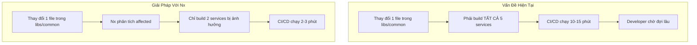
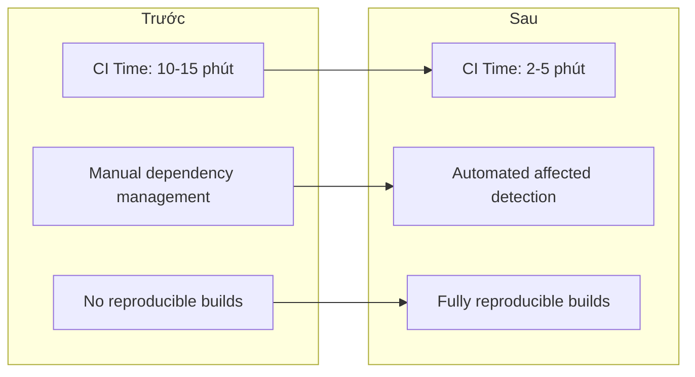

# Phân Tích: Tại Sao Cần Nx + Nix?

> Phân tích chi tiết lý do cần migrate từ NestJS CLI Monorepo sang Nx Workspace và thiết lập Nix Shell chuẩn.

## 1. Hiện Trạng Dự Án

### 1.1. Thông Tin Dự Án nestjs-ecommerce

| Thuộc Tính | Giá Trị |
|------------|---------|
| **Kiến trúc** | Microservices Monorepo |
| **Công cụ quản lý hiện tại** | NestJS CLI (`nest-cli.json`) |
| **Số Applications** | 5 (api-gateway, order-management, customer-service, inventory-service, notification-service) |
| **Số Libraries** | 1 (common) |
| **Package Manager** | Yarn → npm (sau migration) |
| **Message Broker** | RabbitMQ |
| **Database** | PostgreSQL + Prisma |
| **Nix** | Basic devShell only |

### 1.2. Vấn Đề Với NestJS CLI Monorepo



---

## 2. So Sánh: NestJS CLI vs Nx

### 2.1. Bảng So Sánh Chi Tiết

| Tiêu Chí | NestJS CLI | Nx | Ưu Thế |
|----------|------------|-----|---------|
| **Setup Complexity** | Đơn giản | Trung bình | NestJS CLI |
| **Build Speed (5 services)** | ~2 phút | ~2 phút | Ngang nhau |
| **Build Speed (20+ services)** | ~10+ phút | ~3 phút (affected) | **Nx** |
| **Affected Commands** | ❌ Không có | ✅ Có | **Nx** |
| **Computation Caching** | ❌ Không | ✅ Local + Remote | **Nx** |
| **Dependency Graph** | ❌ Không | ✅ `nx graph` | **Nx** |
| **Module Boundaries** | ❌ Thủ công | ✅ ESLint rules | **Nx** |
| **Code Generators** | ✅ `nest g` | ✅ + Custom Generators | **Nx** |
| **CI/CD Optimization** | ❌ Thủ công | ✅ Tự động (affected) | **Nx** |
| **Multi-framework** | ❌ Chỉ NestJS | ✅ NestJS, React, Next.js... | **Nx** |

### 2.2. Công Thức Tính Thời Gian Build

```
# NestJS CLI: Thời gian tuyến tính
Build Time = N × Average Service Build Time
Với N = 5 services, mỗi service 30s → 2.5 phút

# Nx với Affected: Thời gian tối ưu
Build Time = M × Average Service Build Time + Cache Lookup
Với M = services bị ảnh hưởng (thường 1-2) → 30-60 giây
```

---

## 3. So Sánh: Nix Shell Hiện Tại vs Mới

### 3.1. Flake.nix Hiện Tại

```nix
# CHỈ có devShell cơ bản
{
  outputs = { ... }: {
    devShells.default = pkgs.mkShell {
      packages = [ nodejs yarn postgresql docker-compose git ];
    };
  };
}
```

**Hạn chế:**
- ❌ Không thể `nix build` - không có `packages` output
- ❌ Không thể `nix run` - không có `apps` output
- ❌ Không có reproducible production builds
- ❌ Thiếu nhiều tools (Nx, Prisma, etc.)

### 3.2. Flake.nix Mới (Sau Migration)

```nix
{
  outputs = { ... }: {
    # Development environment
    devShells.default = pkgs.mkShell { ... };
    devShells.ci = pkgs.mkShell { ... };
    
    # Reproducible builds
    packages.api-gateway = buildNpmPackage { ... };
    packages.order-management = buildNpmPackage { ... };
    # ...
    
    # Run applications
    apps.api-gateway = { type = "app"; program = ...; };
    apps.order-management = { type = "app"; program = ...; };
    # ...
    
    # Quality checks
    checks = { lint = ...; typecheck = ...; };
    
    # Code formatter
    formatter = pkgs.alejandra;
  };
}
```

**Lợi ích:**
- ✅ `nix develop` - Full development environment
- ✅ `nix build .#api-gateway` - Reproducible builds
- ✅ `nix run .#api-gateway` - Run service trực tiếp
- ✅ `nix flake check` - Automated quality checks
- ✅ Tất cả tools được version-locked

---

## 4. Tại Sao Chuyển Từ Yarn Sang npm?

### 4.1. Lý Do Kỹ Thuật

| Tiêu Chí | Yarn | npm (cho Nix) |
|----------|------|---------------|
| **Nix Integration** | `yarn2nix` (phức tạp) | `buildNpmPackage` (đơn giản) |
| **Lock File** | `yarn.lock` | `package-lock.json` |
| **Nixpkgs Support** | Cũ, ít maintenance | **Mới, active development** |
| **importNpmLock** | ❌ Không hỗ trợ | ✅ Hỗ trợ native |
| **Documentation** | Hạn chế | **Đầy đủ** |

### 4.2. Trích Dẫn Từ Nixpkgs Manual

> "buildNpmPackage allows you to package npm-based projects in Nixpkgs without the use of an auto-generated dependencies file... It works by utilizing npm's cache functionality -- creating a reproducible cache that contains the dependencies of a project."

### 4.3. Migration Path

```bash
# Bước 1: Xóa yarn.lock
rm yarn.lock

# Bước 2: Xóa node_modules
rm -rf node_modules

# Bước 3: Tạo package-lock.json
npm install

# Bước 4: Update scripts trong package.json nếu cần
# (hầu hết scripts tương thích giữa yarn và npm)
```

---

## 5. Kết Luận

### 5.1. Đề Xuất: MIGRATE SANG Nx + Nix

| Yếu Tố | Đánh Giá |
|--------|----------|
| **Cần thiết** | ⭐⭐⭐⭐⭐ Rất cần thiết |
| **Độ phức tạp** | ⭐⭐⭐ Trung bình |
| **Thời gian** | 6-9 ngày |
| **ROI** | ⭐⭐⭐⭐⭐ Rất cao |

### 5.2. Dự Kiến Lợi Ích Sau Migration



---

## 6. Tham Khảo

- [README.md của dự án](../../README.md) - Đã đề cập: "A more sophisticated method, such as using a dedicated package (Nx) for shared contracts and utilities"
- [Nx NestJS Monorepo Guide](../../docs/Nx%20NestJS%20Monorepo/)
- [uber-eats-clone-app](../../uber-eats-clone-app/) - Reference implementation với Nx
