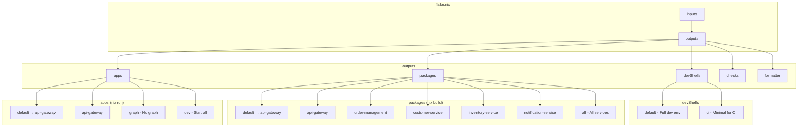

# Hướng Dẫn Nix Flake Chi Tiết

> Hướng dẫn toàn diện về cấu hình Nix Flake cho dự án nestjs-ecommerce với best practices.

## 1. Tổng Quan Flake Outputs

### 1.1. Sơ Đồ Kiến Trúc



---

## 2. Chi Tiết Từng Phần

### 2.1. Inputs

```nix
inputs = {
  # Pin nixpkgs để đảm bảo reproducibility
  nixpkgs.url = "github:nixos/nixpkgs/nixos-24.11";
  
  # Utility để hỗ trợ multi-system
  flake-utils.url = "github:numtide/flake-utils";
};
```

**Giải thích:**
- `nixpkgs`: Nix Packages collection, chứa tất cả packages
- `nixos-24.11`: Version ổn định, được test kỹ
- `flake-utils`: Helper để generate outputs cho nhiều systems (x86_64-linux, aarch64-darwin, etc.)

### 2.2. devShells

```nix
devShells = {
  # Shell chính cho development
  default = pkgs.mkShell {
    name = "ecommerce-dev";
    
    packages = with pkgs; [
      # Node.js ecosystem
      nodejs_22
      nodePackages.npm
      nodePackages.typescript
      nodePackages.ts-node
      
      # Database
      postgresql_16
      
      # Docker
      docker-compose
      
      # Prisma (cần special handling)
      prisma-engines
      openssl
      
      # Dev tools
      git jq curl wget ripgrep fd
      pkg-config gnumake
    ];
    
    env = {
      NODE_ENV = "development";
      
      # Prisma engines paths
      PRISMA_QUERY_ENGINE_LIBRARY = "${pkgs.prisma-engines}/lib/libquery_engine.node";
      PRISMA_QUERY_ENGINE_BINARY = "${pkgs.prisma-engines}/bin/query-engine";
      PRISMA_SCHEMA_ENGINE_BINARY = "${pkgs.prisma-engines}/bin/schema-engine";
      
      # OpenSSL for native modules
      OPENSSL_DIR = "${pkgs.openssl.dev}";
      OPENSSL_LIB_DIR = "${pkgs.openssl.out}/lib";
      
      # Docker BuildKit
      DOCKER_BUILDKIT = "1";
    };
    
    shellHook = ''
      echo "🚀 NestJS E-commerce Dev Environment"
      # ... welcome message
    '';
  };
  
  # Shell tối giản cho CI/CD
  ci = pkgs.mkShell {
    name = "ecommerce-ci";
    packages = with pkgs; [ nodejs_22 git ];
  };
};
```

### 2.3. packages (buildNpmPackage)

```nix
packages = {
  # Default package
  default = self.packages.${system}.api-gateway;
  
  # Build api-gateway service
  api-gateway = pkgs.buildNpmPackage {
    pname = "ecommerce-api-gateway";
    version = "0.0.1";
    
    # Source code
    src = ./.;
    
    # Use importNpmLock for dependencies
    npmDeps = pkgs.importNpmLock {
      npmRoot = ./.;
    };
    npmConfigHook = pkgs.importNpmLock.npmConfigHook;
    
    # Build configuration
    npmBuildScript = "build";  # Runs: npm run build
    npmBuildFlags = [ "--" "api-gateway" ];  # Passes to nx build
    
    # Install phase
    installPhase = ''
      mkdir -p $out
      cp -r dist/apps/api-gateway/* $out/
      
      # Create executable wrapper
      mkdir -p $out/bin
      cat > $out/bin/api-gateway << EOF
      #!/bin/sh
      exec ${pkgs.nodejs_22}/bin/node $out/main.js "\$@"
      EOF
      chmod +x $out/bin/api-gateway
    '';
    
    meta = {
      description = "API Gateway for E-commerce";
      mainProgram = "api-gateway";
    };
  };
  
  # ... other services
};
```

### 2.4. apps

```nix
apps = {
  default = self.apps.${system}.api-gateway;
  
  api-gateway = {
    type = "app";
    program = "${self.packages.${system}.api-gateway}/bin/api-gateway";
    meta.description = "Run API Gateway service";
  };
  
  # Helper: Open Nx graph
  graph = {
    type = "app";
    program = toString (pkgs.writeShellScript "nx-graph" ''
      cd ${self}
      ${pkgs.nodejs_22}/bin/npx nx graph
    '');
    meta.description = "Open Nx dependency graph";
  };
};
```

### 2.5. checks

```nix
checks = {
  # Lint check
  lint = pkgs.runCommand "lint-check" {
    buildInputs = [ pkgs.nodejs_22 ];
  } ''
    cd ${self}
    npm run lint
    touch $out
  '';
  
  # Type check
  typecheck = pkgs.runCommand "type-check" {
    buildInputs = [ pkgs.nodejs_22 ];
  } ''
    cd ${self}
    npx tsc --noEmit
    touch $out
  '';
};
```

---

## 3. Best Practices

### 3.1. Pin Nixpkgs Version

```nix
# ✅ GOOD: Pin to stable version
nixpkgs.url = "github:nixos/nixpkgs/nixos-24.11";

# ❌ BAD: Use unstable
nixpkgs.url = "github:nixos/nixpkgs/nixpkgs-unstable";
```

### 3.2. Sử dụng importNpmLock thay vì npmDepsHash

```nix
# ✅ GOOD: importNpmLock (không cần tính hash)
npmDeps = pkgs.importNpmLock { npmRoot = ./.; };
npmConfigHook = pkgs.importNpmLock.npmConfigHook;

# ❌ BAD: Phải tính hash thủ công
npmDepsHash = "sha256-xxxxx...";  # Phải update khi deps thay đổi
```

### 3.3. Prisma Integration

```nix
# Prisma cần special handling cho Nix
env = {
  # Point to Nix-provided engines
  PRISMA_QUERY_ENGINE_LIBRARY = "${pkgs.prisma-engines}/lib/libquery_engine.node";
  PRISMA_QUERY_ENGINE_BINARY = "${pkgs.prisma-engines}/bin/query-engine";
  PRISMA_SCHEMA_ENGINE_BINARY = "${pkgs.prisma-engines}/bin/schema-engine";
  
  # OpenSSL paths (required by Prisma)
  OPENSSL_DIR = "${pkgs.openssl.dev}";
  OPENSSL_LIB_DIR = "${pkgs.openssl.out}/lib";
  OPENSSL_INCLUDE_DIR = "${pkgs.openssl.dev}/include";
};
```

### 3.4. Docker Compose trong Shell

```nix
packages = with pkgs; [
  docker-compose  # Cho docker-compose command
];

env = {
  DOCKER_BUILDKIT = "1";           # Enable BuildKit
  COMPOSE_DOCKER_CLI_BUILD = "1";  # Use Docker CLI for build
};
```

---

## 4. Troubleshooting

### 4.1. "Package not found" Error

```bash
# Tìm tên package đúng
nix search nixpkgs nodejs

# Hoặc tìm trong Nix packages search
# https://search.nixos.org/packages
```

### 4.2. Prisma Engine Not Found

```bash
# Verify Prisma engines installed
ls -la $(nix eval --raw nixpkgs#prisma-engines)/bin/

# Set environment manually nếu cần
export PRISMA_QUERY_ENGINE_BINARY=$(which query-engine)
```

### 4.3. npm Install Fails in Nix Build

```bash
# Debug với verbose output
nix build .#api-gateway --verbose

# Hoặc enter build environment
nix develop .#api-gateway
```

### 4.4. Flake Check Fails

```bash
# Run checks individually
nix build .#checks.x86_64-linux.lint
nix build .#checks.x86_64-linux.typecheck
```

---

## 5. Commands Reference

| Command | Mô Tả |
|---------|-------|
| `nix develop` | Enter development shell |
| `nix develop .#ci` | Enter CI shell |
| `nix build .#api-gateway` | Build api-gateway |
| `nix build .#all` | Build all services |
| `nix run .#api-gateway` | Run api-gateway |
| `nix run .#graph` | Open Nx graph |
| `nix flake check` | Run all checks |
| `nix flake show` | Show flake outputs |
| `nix flake update` | Update flake.lock |

---

## 6. Tham Khảo

- [Nixpkgs JavaScript Manual](https://nixos.org/manual/nixpkgs/stable/#language-javascript)
- [buildNpmPackage Reference](https://ryantm.github.io/nixpkgs/languages-frameworks/javascript/)
- [NixOS Wiki - Flakes](https://wiki.nixos.org/wiki/Flakes)
- [Prisma + Nix Guide](https://github.com/prisma/prisma/issues/3026)
