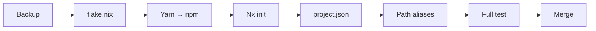

# Kế Hoạch Rollback

> Kế hoạch chi tiết để rollback các thay đổi nếu migration gặp vấn đề.

## 1. Tổng Quan

### 1.1. Các Điểm Có Thể Rollback

| Phase | Thay Đổi | Mức Độ Rủi Ro | Rollback Complexity |
|-------|----------|---------------|---------------------|
| Yarn → npm | Package manager | Thấp | Dễ |
| flake.nix | Nix configuration | Thấp | Dễ |
| Nx init | nx.json, project.json | Trung bình | Trung bình |
| Path aliases | tsconfig, imports | Cao | Khó |

### 1.2. Backup Points

Trước khi bắt đầu migration, đảm bảo có các backup:

```bash
# Git branch backup
git checkout -b backup/pre-nx-migration
git push origin backup/pre-nx-migration

# File system backup (optional)
cp -r . ../nestjs-ecommerce-backup
```

---

## 2. Rollback từng Phase

### 2.1. Rollback Yarn → npm

**Nếu npm gặp vấn đề, quay lại Yarn:**

```bash
# Xóa npm artifacts
rm package-lock.json
rm -rf node_modules

# Restore yarn.lock từ backup
git checkout backup/pre-nx-migration -- yarn.lock

# Chạy yarn
yarn install

# Verify
yarn --version
yarn list --depth=0
```

### 2.2. Rollback flake.nix

**Nếu flake.nix mới có vấn đề:**

```bash
# Restore từ backup branch
git checkout backup/pre-nx-migration -- flake.nix flake.lock

# Update flake
nix flake update

# Verify
nix develop
```

**Hoặc sử dụng backup file:**

```bash
# Nếu đã tạo backup file
cp flake.nix.bak flake.nix

# Verify
nix flake check
```

### 2.3. Rollback Nx

**Nếu Nx gặp vấn đề, quay lại NestJS CLI:**

```bash
# 1. Xóa Nx artifacts
rm nx.json
rm -rf .nx
find apps libs -name "project.json" -delete

# 2. Restore nest-cli.json
git checkout backup/pre-nx-migration -- nest-cli.json

# 3. Xóa Nx packages
npm uninstall nx @nx/nest @nx/js @nx/webpack @nx/eslint @nx/jest

# 4. Clean và reinstall
rm -rf node_modules
npm install

# 5. Verify
nest info
nest build api-gateway
```

### 2.4. Rollback Path Aliases

**Nếu path aliases gây lỗi build:**

```bash
# 1. Restore tsconfig files
git checkout backup/pre-nx-migration -- tsconfig.json tsconfig.base.json

# 2. Restore tất cả imports
git checkout backup/pre-nx-migration -- apps/ libs/

# 3. Rebuild
npm run build

# 4. Verify
npm run test
```

---

## 3. Full Rollback

**Nếu cần rollback toàn bộ migration:**

```bash
# Option 1: Git reset (nếu chưa merge)
git checkout main
git branch -D feature/nx-migration

# Option 2: Git revert (nếu đã merge)
git revert --no-commit HEAD~<number-of-commits>..HEAD
git commit -m "revert: rollback Nx migration"

# Option 3: Force reset (nguy hiểm, chỉ dùng khi cần thiết)
git checkout backup/pre-nx-migration
git checkout -B main
git push -f origin main
```

---

## 4. Troubleshooting Trước Khi Rollback

### 4.1. Nx Build Fails

```bash
# Clear Nx cache
npx nx reset

# Verify project config
npx nx show project api-gateway --json

# Check for circular dependencies
npx nx graph

# Build với verbose
npx nx build api-gateway --verbose
```

### 4.2. Nix Build Fails

```bash
# Check flake syntax
nix flake check

# Build với print-build-logs
nix build .#api-gateway --print-build-logs

# Enter build environment để debug
nix develop .#api-gateway
```

### 4.3. Import Errors

```bash
# Verify path aliases
cat tsconfig.base.json | jq '.compilerOptions.paths'

# Search for old imports
grep -r "@app/common" apps/ libs/

# Verify TypeScript resolution
npx tsc --noEmit --traceResolution | head -100
```

---

## 5. Checklist Trước Khi Rollback

- [ ] Đã thử tất cả troubleshooting steps?
- [ ] Đã tham khảo documentation?
- [ ] Đã hỏi team hoặc tìm kiếm online?
- [ ] Đã backup current state trước khi rollback?
- [ ] Đã xác định chính xác phase cần rollback?

---

## 6. Sau Khi Rollback

### 6.1. Verify Application Works

```bash
# Build
npm run build
# hoặc
nest build api-gateway

# Test
npm run test

# Start
npm run start:api-gateway
```

### 6.2. Document Issues

Tạo issue hoặc document để ghi nhận:
- Vấn đề gặp phải
- Bước đã thử trước khi rollback
- Nguyên nhân (nếu biết)
- Đề xuất giải pháp cho lần sau

### 6.3. Notify Team

- Thông báo về rollback
- Chia sẻ lessons learned
- Cập nhật timeline nếu cần

---

## 7. Liên Hệ Hỗ Trợ

Nếu gặp vấn đề không thể tự giải quyết:

| Nguồn | Link |
|-------|------|
| Nx Discord | https://go.nx.dev/community |
| NixOS Discourse | https://discourse.nixos.org/ |
| NestJS Discord | https://discord.gg/nestjs |
| Stack Overflow | https://stackoverflow.com/questions/tagged/nx-monorepo |

---

## 8. Prevention: Lessons Learned

### 8.1. Best Practices cho Migration

1. **Luôn backup trước khi bắt đầu**
2. **Migration từng phase, verify mỗi phase**
3. **Không skip verification steps**
4. **Commit thường xuyên với messages rõ ràng**
5. **Test trên branch riêng trước khi merge**

### 8.2. Recommended Migration Order



Mỗi bước có thể rollback độc lập mà không ảnh hưởng các bước trước.
