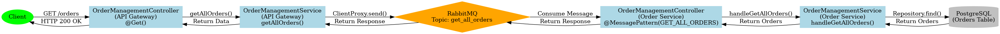
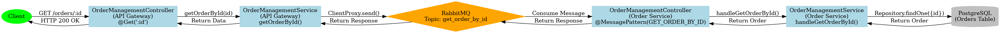
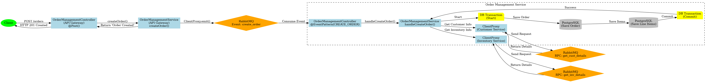
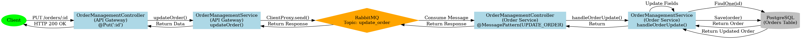
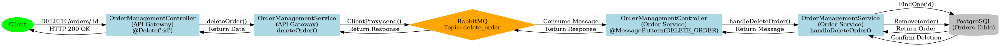
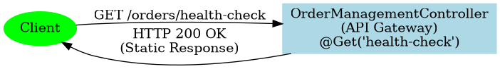

# Báo cáo Hoàn thành Công việc: Tạo Call Graph

## A. Tóm tắt công việc
Đã hoàn thành việc phân tích và tạo sơ đồ luồng dữ liệu (Call Graph) cho module `OrderManagement` và `API Gateway`. Tổng cộng đã tạo 6 sơ đồ tương ứng với 6 endpoint chính, giúp trực quan hóa luồng đi của dữ liệu từ Controller xuống Database.

## B. Chi tiết triển khai
Đã tạo các file định nghĩa đồ thị `.dot` và chuyển đổi sang hình ảnh `.png` trong thư mục `docs/call-graphs/`:

### 1. Get All Orders
- **File**: `get-all-orders.dot`
- **Mô tả**: Luồng lấy danh sách đơn hàng.
- **Path**: Gateway -> RabbitMQ -> Order Service -> DB (Find).

---

### 2. Get Order By ID
- **File**: `get-order-by-id.dot`
- **Mô tả**: Luồng lấy chi tiết đơn hàng.
- **Path**: Gateway -> RabbitMQ -> Order Service -> DB (FindOne).

---

### 3. Create Order
- **File**: `create-order.dot`
- **Mô tả**: Luồng tạo đơn hàng phức tạp với Event-driven và DB Transaction.
- **Chi tiết**: Gateway -> RabbitMQ (Event) -> Order Service -> Mock Services (Customer/Inventory) -> DB Transaction.

---

### 4. Update Order
- **File**: `update-order.dot`
- **Mô tả**: Luồng cập nhật đơn hàng.

---

### 5. Delete Order
- **File**: `delete-order.dot`
- **Mô tả**: Luồng xóa đơn hàng.

---

### 6. Health Check
- **File**: `health-check.dot`
- **Mô tả**: API kiểm tra trạng thái đơn giản.

## C. Kiểm thử
- **Kiểm thử thủ công**:
    - Đã chạy lệnh `dot -Tpng` thành công cho tất cả 6 file.
    - Đã kiểm tra sự tồn tại và nội dung của các file `.png` (các file đều có dung lượng hợp lý > 20KB).
    - Đã tạo file `walkthrough.md` để xem trước các biểu đồ.

## D. Thách thức và Giải pháp
- **Thách thức**: Thể hiện rõ ràng các giao tiếp không đồng bộ (Event-driven) và RPC qua RabbitMQ trên cùng một biểu đồ tĩnh.
- **Giải pháp**: Sử dụng các node có hình dạng khác nhau (diamond cho RabbitMQ, box cho Service) và nhóm các thành phần liên quan (subgraph) để dễ theo dõi.

## E. Cải tiến và Tối ưu hóa
- Biểu đồ giúp dễ dàng nhận diện các điểm phụ thuộc (như Customer Service và Inventory Service) trong luồng tạo đơn hàng.
- Cung cấp tài liệu trực quan cho việc onboarding thành viên mới hoặc debug hệ thống.

## F. Công cụ và Công nghệ sử dụng
- **Phân tích mã nguồn**: Thủ công (Manual Code Analysis).
- **Trực quan hóa**: Graphviz (`dot` CLI).
- **Định dạng**: DOT language, PNG image.
