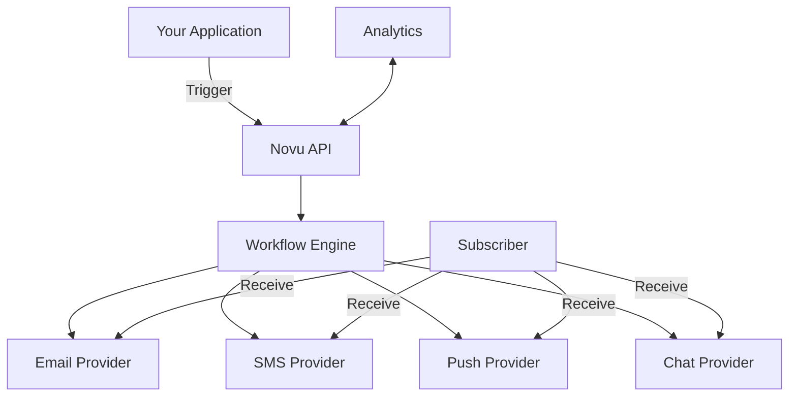

# Novu Platform Overview

## Giới thiệu
Novu là nền tảng notification infrastructure mã nguồn mở, cung cấp giải pháp toàn diện cho việc gửi thông báo đa kênh thông qua một API thống nhất.

## Key Features

### 1. Đa kênh thông báo
- **Email**: Hỗ trợ nhiều nhà cung cấp (SendGrid, Mailchimp, SMTP, v.v.)
- **SMS**: Tích hợp với Twilio, AWS SNS, và nhiều nhà mạng khác
- **Push Notifications**: Hỗ trợ FCM (Firebase) và APNS (Apple Push Notification Service)
- **In-App Notifications**: Thông báo trong ứng dụng với real-time updates
- **Chat**: Tích hợp Slack, Microsoft Teams, Discord

### 2. Workflow Engine
- Tạo các luồng thông báo phức tạp với giao diện kéo thả
- Hỗ trợ điều kiện và phân nhánh
- Tích hợp delay giữa các bước
- Template variables và dynamic content

### 3. Quản lý người dùng
- Centralized subscriber profiles
- User preferences và notification settings
- Unsubscribe management
- Activity feed và delivery tracking

### 4. Analytics & Monitoring
- Real-time delivery tracking
- Tỷ lệ mở, click, và engagement
- Error tracking và alerting
- Custom metrics và reporting

## Kiến trúc Novu

## Tại sao chọn Novu?

### Lợi ích
- **Unified API**: Một API cho tất cả các kênh thông báo
- **Extensible**: Dễ dàng thêm providers mới
- **Self-hosted**: Toàn quyền kiểm soát dữ liệu
- **Developer-friendly**: Tài liệu đầy đủ, SDKs cho nhiều ngôn ngữ
- **Active community**: Hỗ trợ từ cộng đồng và team phát triển

### Use Cases cho E-commerce
1. Xác nhận đơn hàng
2. Cập nhật vận chuyển
3. Khuyến mãi và ưu đãi
4. Nhắc nhở giỏ hàng bỏ dở
5. Cảnh báo tình trạng kho hàng
6. Đánh giá sản phẩm
7. Thông báo bảo hành

## So sánh với các giải pháp khác

| Feature           | Novu | SendGrid | Firebase | AWS SNS |
|-------------------|------|----------|----------|---------|
| Multi-channel     | ✅    | ❌ (Chỉ email) | ✅       | ✅       |
| Open Source       | ✅    | ❌        | ❌        | ❌       |
| Self-hosted       | ✅    | ❌        | ❌        | ❌       |
| Workflow Builder  | ✅    | ❌        | ❌        | ❌       |
| Real-time Updates | ✅    | ❌        | ✅        | ✅       |
| Pricing           | Miễn phí/Mở nguồn | Trả phí | Trả phí  | Trả phí |

## Các bước tiếp theo
1. Cài đặt và cấu hình Novu
2. Tích hợp vào hệ thống hiện tại
3. Tạo các workflow thông báo cơ bản
4. Triển khai và kiểm thử
5. Giám sát và tối ưu hiệu năng

## Tài liệu tham khảo
- [Novu Documentation](https://docs.novu.co/)
- [GitHub Repository](https://github.com/novuhq/novu)
- [Community Forum](https://discord.gg/novu)
