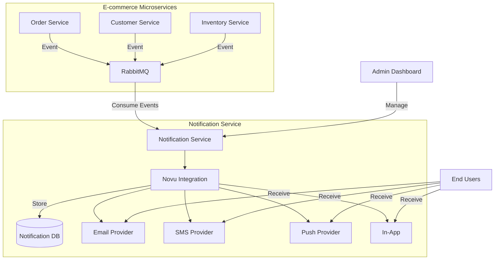
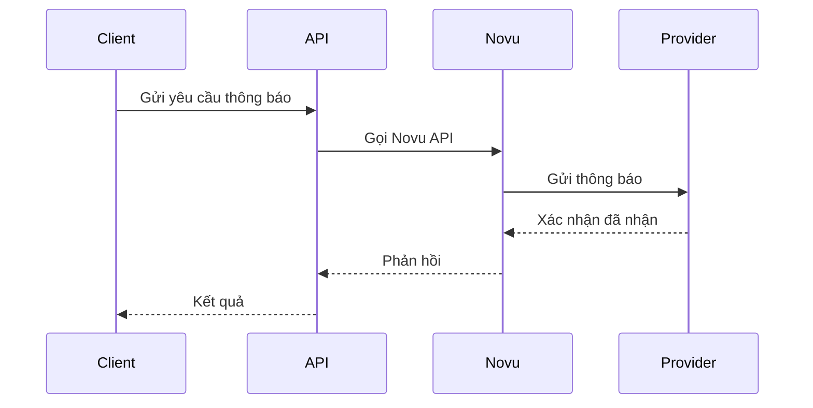
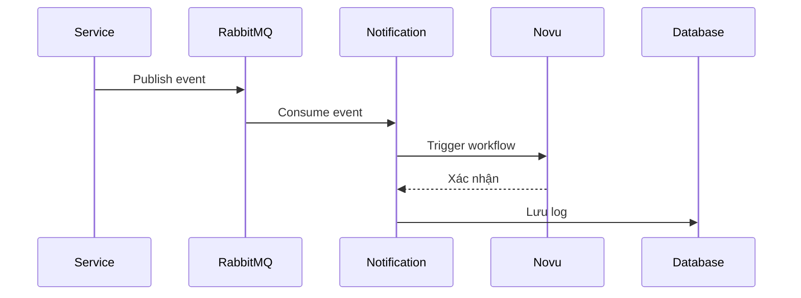

# Kiến trúc hệ thống Notification Service

## Tổng quan kiến trúc

## Các thành phần chính

### 1. Notification Service
- **API Layer**: Xử lý các request HTTP
- **Event Handlers**: Xử lý các sự kiện từ hệ thống
- **Notification Engine**: Điều phối và gửi thông báo
- **Template Management**: Quản lý mẫu thông báo
- **User Preferences**: Quản lý cài đặt thông báo của người dùng

### 2. Novu Integration Layer
- **Novu SDK**: Tích hợp với Novu API
- **Provider Management**: Quản lý các nhà cung cấp dịch vụ
- **Retry & Circuit Breaker**: Xử lý lỗi và thử lại
- **Rate Limiting**: Giới hạn tốc độ gửi thông báo

### 3. Data Storage
- **PostgreSQL**: Lưu trữ dữ liệu thông báo
- **Redis**: Cache và quản lý phiên
- **Message Queue**: RabbitMQ cho xử lý bất đồng bộ

## Luồng dữ liệu

### 1. Gửi thông báo

### 2. Xử lý sự kiện

## Kiến trúc triển khai

### 1. Development
- Chạy Novu dưới dạng container
- Sử dụng local database và message queue
- Mock các provider bên thứ ba

### 2. Staging/Production
- Novu cluster với high availability
- Database replication và sharding
- Message queue cluster
- Monitoring và alerting

## Bảo mật

### 1. Authentication & Authorization
- JWT cho API authentication
- Role-based access control (RBAC)
- API rate limiting

### 2. Data Protection
- Mã hóa dữ liệu nhạy cảm
- SSL/TLS cho tất cả kết nối
- Audit logging

### 3. Compliance
- Tuân thủ GDPR
- Quản lý consent
- Data retention policies

## Scaling

### 1. Horizontal Scaling
- Auto-scaling cho Notification Service
- Database read replicas
- Distributed cache

### 2. Performance Optimization
- Connection pooling
- Batch processing
- Asynchronous processing

## Monitoring & Logging

### 1. Metrics
- Số lượng thông báo theo loại
- Tỷ lệ thành công/thất bại
- Thời gian phản hồi

### 2. Logging
- Chi tiết lỗi
- Audit trails
- Performance metrics

### 3. Alerting
- Thông báo lỗi
- Performance degradation
- Quota warnings

## Tích hợp với hệ thống hiện tại

### 1. Order Service
- Order confirmation emails
- Shipping updates
- Payment reminders

### 2. Customer Service
- Welcome emails
- Password resets
- Account notifications

### 3. Inventory Service
- Low stock alerts
- Back in stock notifications
- Price drop alerts

## Tài liệu tham khảo
- [Novu Architecture](https://docs.novu.co/architecture/overview)
- [Microservices Patterns](https://microservices.io/)
- [NestJS Documentation](https://docs.nestjs.com/)
