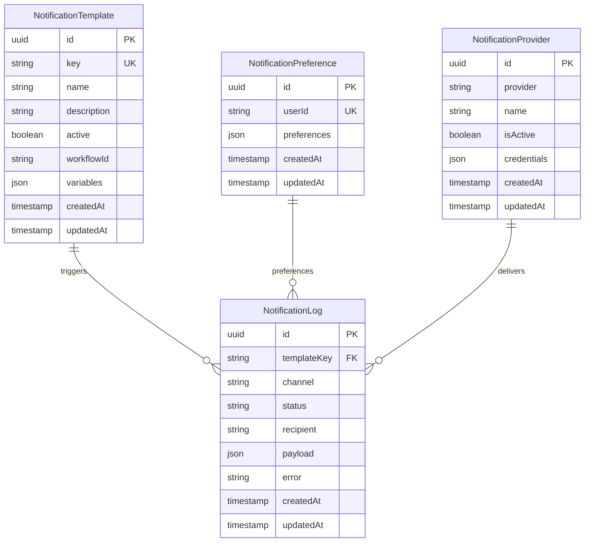

# Database Schema cho Notification Service

## Tổng quan
Schema được thiết kế để hỗ trợ đầy đủ các tính năng của notification service bao gồm template management, user preferences, và comprehensive logging.

## Schema Design

### 1. Notification Templates
```sql
CREATE TABLE notification_templates (
    id UUID PRIMARY KEY DEFAULT gen_random_uuid(),
    key VARCHAR(255) UNIQUE NOT NULL,
    name VARCHAR(255) NOT NULL,
    description TEXT,
    active BOOLEAN DEFAULT true,
    workflow_id VARCHAR(255) NOT NULL, -- Novu workflow ID
    variables JSONB, -- Template variables schema
    created_at TIMESTAMP DEFAULT CURRENT_TIMESTAMP,
    updated_at TIMESTAMP DEFAULT CURRENT_TIMESTAMP
);

CREATE INDEX idx_notification_templates_key ON notification_templates(key);
CREATE INDEX idx_notification_templates_active ON notification_templates(active);
```

### 2. Notification Logs
```sql
CREATE TABLE notification_logs (
    id UUID PRIMARY KEY DEFAULT gen_random_uuid(),
    template_key VARCHAR(255) NOT NULL,
    channel VARCHAR(50) NOT NULL, -- email, sms, push, in_app
    status VARCHAR(20) NOT NULL, -- pending, sent, delivered, failed
    recipient VARCHAR(255) NOT NULL, -- email, phone, or user ID
    payload JSONB, -- Notification data
    error TEXT,
    created_at TIMESTAMP DEFAULT CURRENT_TIMESTAMP,
    updated_at TIMESTAMP DEFAULT CURRENT_TIMESTAMP
);

CREATE INDEX idx_notification_logs_recipient ON notification_logs(recipient);
CREATE INDEX idx_notification_logs_template_key ON notification_logs(template_key);
CREATE INDEX idx_notification_logs_status ON notification_logs(status);
CREATE INDEX idx_notification_logs_created_at ON notification_logs(created_at);
```

### 3. User Notification Preferences
```sql
CREATE TABLE notification_preferences (
    id UUID PRIMARY KEY DEFAULT gen_random_uuid(),
    user_id VARCHAR(255) UNIQUE NOT NULL,
    preferences JSONB NOT NULL DEFAULT '{}', -- Channel preferences
    created_at TIMESTAMP DEFAULT CURRENT_TIMESTAMP,
    updated_at TIMESTAMP DEFAULT CURRENT_TIMESTAMP
);

CREATE INDEX idx_notification_preferences_user_id ON notification_preferences(user_id);
```

### 4. Notification Provider Configuration
```sql
CREATE TABLE notification_providers (
    id UUID PRIMARY KEY DEFAULT gen_random_uuid(),
    provider VARCHAR(50) NOT NULL, -- novu, sendgrid, twilio, etc.
    name VARCHAR(255) NOT NULL,
    is_active BOOLEAN DEFAULT true,
    credentials JSONB NOT NULL, -- Encrypted provider credentials
    created_at TIMESTAMP DEFAULT CURRENT_TIMESTAMP,
    updated_at TIMESTAMP DEFAULT CURRENT_TIMESTAMP,
    CONSTRAINT unique_provider_name UNIQUE(provider, name)
);
```

## Prisma Schema

```prisma
// Notification Template
model NotificationTemplate {
  id          String   @id @default(uuid())
  key         String   @unique
  name        String
  description String?
  active      Boolean  @default(true)
  workflowId  String   @map("workflow_id") // Novu workflow ID
  variables   Json?    // Template variables schema
  createdAt   DateTime @default(now()) @map("created_at")
  updatedAt   DateTime @updatedAt @map("updated_at")

  @@map("notification_templates")
  @@index([key])
  @@index([active])
}

// Notification Log
model NotificationLog {
  id           String   @id @default(uuid())
  templateKey  String   @map("template_key")
  channel      String   // email, sms, push, in_app
  status       String   // pending, sent, delivered, failed
  recipient    String   // email, phone, or user ID
  payload      Json?    // Notification data
  error        String?
  createdAt    DateTime @default(now()) @map("created_at")
  updatedAt    DateTime @updatedAt @map("updated_at")

  @@map("notification_logs")
  @@index([recipient])
  @@index([templateKey])
  @@index([status])
  @@index([createdAt])
}

// User Notification Preferences
model NotificationPreference {
  id          String   @id @default(uuid())
  userId      String   @unique @map("user_id")
  preferences Json     @default("{}") // Channel preferences
  createdAt   DateTime @default(now()) @map("created_at")
  updatedAt   DateTime @updatedAt @map("updated_at")

  @@map("notification_preferences")
  @@index([userId])
}

// Notification Provider Configuration
model NotificationProvider {
  id          String   @id @default(uuid())
  provider    String   // novu, sendgrid, twilio, etc.
  name        String
  isActive    Boolean  @default(true) @map("is_active")
  credentials Json     // Encrypted provider credentials
  createdAt   DateTime @default(now()) @map("created_at")
  updatedAt   DateTime @updatedAt @map("updated_at")

  @@unique([provider, name])
  @@map("notification_providers")
}
```

## Data Relationships



## Indexes và Performance

### 1. Primary Indexes
- Tất cả bảng đều có primary key là UUID
- Unique constraints trên các trường cần thiết

### 2. Secondary Indexes
- `notification_logs.recipient`: Tìm kiếm log theo người dùng
- `notification_logs.template_key`: Tìm kiếm log theo template
- `notification_logs.status`: Lọc theo trạng thái
- `notification_logs.created_at`: Phân tích theo thời gian

### 3. JSON Indexes
- `notification_preferences.preferences`: Truy vấn preferences
- `notification_templates.variables`: Template variable lookup

## Data Migration Strategy

### 1. Initial Migration
```sql
-- Tạo các bảng mới
-- Thiết lập indexes
-- Chuyển dữ liệu cũ (nếu có)
-- Cập nhật foreign keys
```

### 2. Rollback Strategy
```sql
-- Xóa indexes
-- Xóa các bảng mới
-- Khôi phục dữ liệu cũ (nếu có)
```

## Backup và Recovery

### 1. Backup Strategy
- Daily full backups
- Hourly incremental backups
- Point-in-time recovery support

### 2. Data Retention
- Notification logs: 90 days
- Template history: 1 year
- User preferences: Indefinite

## Security Considerations

### 1. Data Encryption
- Mã hóa credentials trong database
- Mã hóa PII trong notification logs
- Secure key management

### 2. Access Control
- Database user permissions
- Row-level security cho sensitive data
- Audit logging cho database access

## Monitoring

### 1. Performance Metrics
- Query response times
- Index usage statistics
- Table size monitoring

### 2. Data Quality
- Data consistency checks
- Referential integrity validation
- Duplicate detection
