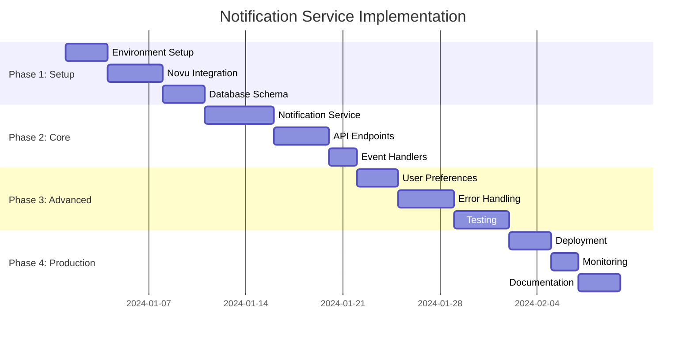

# Implementation Roadmap

## Tổng quan
Roadmap chi tiết để triển khai Notification Service với Novu trong 10 tuần, bao gồm các milestone, deliverables và success criteria.

## Timeline Overview

## Phase 1: Core Setup (Week 1-2)

### Week 1: Environment & Infrastructure

#### Day 1-2: Project Setup
**Tasks:**
- [ ] Set up notification service module structure
- [ ] Configure TypeScript and build tools
- [ ] Set up development environment with Docker
- [ ] Create initial project documentation

**Deliverables:**
- [ ] Notification service module created
- [ ] Docker development environment running
- [ ] Basic project structure in place

**Success Criteria:**
- [ ] Service starts without errors
- [ ] Hot reload working in development
- [ ] Basic health check endpoint responding

#### Day 3-4: Novu Integration
**Tasks:**
- [ ] Set up Novu account or self-hosted instance
- [ ] Install and configure @novu/api SDK
- [ ] Create NovuService with basic functionality
- [ ] Test Novu API connectivity

**Deliverables:**
- [ ] NovuService implemented
- [ ] API key configuration
- [ ] Basic workflow trigger functionality

**Success Criteria:**
- [ ] Successfully connect to Novu API
- [ ] Can trigger test workflows
- [ ] Error handling for API failures

#### Day 5-7: Database Schema
**Tasks:**
- [ ] Design notification database schema
- [ ] Create Prisma models for notification tables
- [ ] Set up database migrations
- [ ] Create seed data for testing

**Deliverables:**
- [ ] Complete database schema
- [ ] Prisma models and migrations
- [ ] Database seed scripts

**Success Criteria:**
- [ ] Database schema created successfully
- [ ] Migrations run without errors
- [ ] Seed data populated correctly

### Week 2: Core Services

#### Day 8-10: Notification Service
**Tasks:**
- [ ] Implement NotificationService with core methods
- [ ] Create order confirmation notifications
- [ ] Implement shipping update notifications
- [ ] Add basic error handling

**Deliverables:**
- [ ] NotificationService with order-related methods
- [ ] Order confirmation workflow
- [ ] Shipping update workflow

**Success Criteria:**
- [ ] Can send order confirmations
- [ ] Can send shipping updates
- [ ] Proper error handling in place

#### Day 11-12: API Endpoints
**Tasks:**
- [ ] Create NotificationController
- [ ] Implement send notification endpoint
- [ ] Add template management endpoints
- [ ] Create user preference endpoints

**Deliverables:**
- [ ] Complete API controller
- [ ] RESTful endpoints for notifications
- [ ] Input validation and error handling

**Success Criteria:**
- [ ] All endpoints responding correctly
- [ ] Proper HTTP status codes
- [ ] Input validation working

#### Day 13-14: Event Handlers
**Tasks:**
- [ ] Set up event-driven architecture
- [ ] Create order event handlers
- [ ] Implement inventory event handlers
- [ ] Test event processing

**Deliverables:**
- [ ] Event handlers for order lifecycle
- [ ] Event handlers for inventory changes
- [ ] Event processing tests

**Success Criteria:**
- [ ] Events trigger notifications correctly
- [ ] No event processing errors
- [ ] Proper event ordering

## Phase 2: Basic Notifications (Week 3-4)

### Week 3: Email & SMS Integration

#### Day 15-17: Email Notifications
**Tasks:**
- [ ] Configure email providers (SendGrid/SMTP)
- [ ] Create email templates
- [ ] Implement email sending logic
- [ ] Add email delivery tracking

**Deliverables:**
- [ ] Email provider configuration
- [ ] Email templates for key notifications
- [ ] Email delivery tracking

**Success Criteria:**
- [ ] Emails sent successfully
- [ ] Delivery status tracked
- [ ] Templates render correctly

#### Day 18-19: SMS Notifications
**Tasks:**
- [ ] Configure SMS provider (Twilio)
- [ ] Create SMS templates
- [ ] Implement SMS sending logic
- [ ] Add SMS delivery tracking

**Deliverables:**
- [ ] SMS provider configuration
- [ ] SMS templates
- [ ] SMS delivery tracking

**Success Criteria:**
- [ ] SMS messages sent successfully
- [ ] Delivery status tracked
- [ ] Proper SMS formatting

#### Day 20-21: Push Notifications
**Tasks:**
- [ ] Configure Firebase Cloud Messaging
- [ ] Create push notification templates
- [ ] Implement push notification sending
- [ ] Add push notification tracking

**Deliverables:**
- [ ] FCM configuration
- [ ] Push notification templates
- [ ] Push notification tracking

**Success Criteria:**
- [ ] Push notifications sent successfully
- [ ] Device token management working
- [ ] Delivery tracking functional

### Week 4: Template Management

#### Day 22-24: Template System
**Tasks:**
- [ ] Create template management service
- [ ] Implement template CRUD operations
- [ ] Add template validation
- [ ] Create template versioning

**Deliverables:**
- [ ] Template management service
- [ ] Template CRUD endpoints
- [ ] Template validation system

**Success Criteria:**
- [ ] Templates can be created/updated/deleted
- [ ] Template validation working
- [ ] Version control functional

#### Day 25-26: User Preferences
**Tasks:**
- [ ] Implement user preference management
- [ ] Create preference endpoints
- [ ] Add channel-specific preferences
- [ ] Implement opt-out functionality

**Deliverables:**
- [ ] User preference service
- [ ] Preference management endpoints
- [ ] Channel-specific settings

**Success Criteria:**
- [ ] User preferences saved/retrieved correctly
- [ ] Opt-out functionality working
- [ ] Channel preferences respected

#### Day 27-28: Notification Logging
**Tasks:**
- [ ] Implement comprehensive logging
- [ ] Create log management endpoints
- [ ] Add log filtering and search
- [ ] Implement log retention policies

**Deliverables:**
- [ ] Notification logging system
- [ ] Log management endpoints
- [ ] Log filtering capabilities

**Success Criteria:**
- [ ] All notifications logged correctly
- [ ] Log search and filtering working
- [ ] Retention policies enforced

## Phase 3: Advanced Features (Week 5-6)

### Week 5: Error Handling & Resilience

#### Day 29-31: Retry Mechanisms
**Tasks:**
- [ ] Implement exponential backoff retry
- [ ] Create circuit breaker pattern
- [ ] Add dead letter queue
- [ ] Implement graceful degradation

**Deliverables:**
- [ ] Retry mechanism with backoff
- [ ] Circuit breaker implementation
- [ ] Dead letter queue system

**Success Criteria:**
- [ ] Failed notifications retried correctly
- [ ] Circuit breaker prevents cascade failures
- [ ] Dead letter queue captures failures

#### Day 32-33: Error Recovery
**Tasks:**
- [ ] Implement error recovery strategies
- [ ] Create fallback notification methods
- [ ] Add manual retry functionality
- [ ] Implement error alerting

**Deliverables:**
- [ ] Error recovery system
- [ ] Fallback notification methods
- [ ] Manual retry interface

**Success Criteria:**
- [ ] Errors recovered automatically where possible
- [ ] Fallback methods work correctly
- [ ] Manual retry interface functional

#### Day 34-35: Performance Optimization
**Tasks:**
- [ ] Implement caching strategies
- [ ] Optimize database queries
- [ ] Add connection pooling
- [ ] Implement rate limiting

**Deliverables:**
- [ ] Caching implementation
- [ ] Optimized database queries
- [ ] Rate limiting system

**Success Criteria:**
- [ ] Response times improved
- [ ] Database performance optimized
- [ ] Rate limiting prevents abuse

### Week 6: Testing & Quality Assurance

#### Day 36-38: Unit Testing
**Tasks:**
- [ ] Write unit tests for all services
- [ ] Create mock implementations
- [ ] Achieve 80%+ code coverage
- [ ] Set up test automation

**Deliverables:**
- [ ] Complete unit test suite
- [ ] Mock implementations
- [ ] Test automation setup

**Success Criteria:**
- [ ] 80%+ code coverage achieved
- [ ] All unit tests passing
- [ ] Test automation working

#### Day 39-40: Integration Testing
**Tasks:**
- [ ] Create integration test suite
- [ ] Test database integration
- [ ] Test external API integration
- [ ] Test event processing

**Deliverables:**
- [ ] Integration test suite
- [ ] Database integration tests
- [ ] External API integration tests

**Success Criteria:**
- [ ] All integration tests passing
- [ ] Database operations working correctly
- [ ] External APIs integrated properly

## Phase 4: Production Deployment (Week 7-8)

### Week 7: Deployment & Infrastructure

#### Day 41-43: Containerization
**Tasks:**
- [ ] Create production Dockerfiles
- [ ] Set up Docker Compose for production
- [ ] Configure environment variables
- [ ] Create deployment scripts

**Deliverables:**
- [ ] Production Docker configuration
- [ ] Deployment automation scripts
- [ ] Environment configuration

**Success Criteria:**
- [ ] Containers build successfully
- [ ] Production deployment working
- [ ] Environment variables configured

#### Day 44-45: Kubernetes Deployment
**Tasks:**
- [ ] Create Kubernetes manifests
- [ ] Set up ingress and services
- [ ] Configure secrets and configmaps
- [ ] Create deployment pipeline

**Deliverables:**
- [ ] Kubernetes manifests
- [ ] Deployment pipeline
- [ ] Infrastructure as code

**Success Criteria:**
- [ ] Kubernetes deployment successful
- [ ] Services accessible
- [ ] Pipeline automated

#### Day 46-47: Monitoring Setup
**Tasks:**
- [ ] Set up Prometheus metrics
- [ ] Create Grafana dashboards
- [ ] Configure alerting rules
- [ ] Set up log aggregation

**Deliverables:**
- [ ] Monitoring dashboards
- [ ] Alerting configuration
- [ ] Log aggregation setup

**Success Criteria:**
- [ ] Metrics collection working
- [ ] Dashboards displaying correctly
- [ ] Alerts configured properly

### Week 8: Security & Performance

#### Day 48-50: Security Hardening
**Tasks:**
- [ ] Implement authentication and authorization
- [ ] Add input validation and sanitization
- [ ] Configure HTTPS and security headers
- [ ] Perform security audit

**Deliverables:**
- [ ] Security implementation
- [ ] Security audit report
- [ ] Hardened configuration

**Success Criteria:**
- [ ] Authentication working correctly
- [ ] Security headers configured
- [ ] No critical security issues

#### Day 51-52: Performance Testing
**Tasks:**
- [ ] Conduct load testing
- [ ] Perform stress testing
- [ ] Optimize performance bottlenecks
- [ ] Document performance metrics

**Deliverables:**
- [ ] Performance test results
- [ ] Performance optimization
- [ ] Performance documentation

**Success Criteria:**
- [ ] System handles expected load
- [ ] Performance meets requirements
- [ ] Bottlenecks identified and resolved

#### Day 53-54: Documentation
**Tasks:**
- [ ] Create API documentation
- [ ] Write deployment guide
- [ ] Create troubleshooting guide
- [ ] Document monitoring procedures

**Deliverables:**
- [ ] Complete API documentation
- [ ] Deployment and operations guides
- [ ] Troubleshooting documentation

**Success Criteria:**
- [ ] Documentation complete and accurate
- [ ] Guides easy to follow
- [ ] Troubleshooting information helpful

## Phase 5: Launch & Optimization (Week 9-10)

### Week 9: Launch Preparation

#### Day 55-57: Final Testing
**Tasks:**
- [ ] Conduct end-to-end testing
- [ ] Perform user acceptance testing
- [ ] Test disaster recovery procedures
- [ ] Validate all requirements

**Deliverables:**
- [ ] E2E test results
- [ ] UAT sign-off
- [ ] Disaster recovery validation

**Success Criteria:**
- [ ] All E2E tests passing
- [ ] UAT completed successfully
- [ ] Disaster recovery validated

#### Day 58-59: Production Deployment
**Tasks:**
- [ ] Deploy to production environment
- [ ] Verify production functionality
- [ ] Monitor initial production usage
- [ ] Address any immediate issues

**Deliverables:**
- [ ] Production deployment
- [ ] Production verification
- [ ] Initial monitoring results

**Success Criteria:**
- [ ] Production deployment successful
- [ ] All functionality working
- [ ] No critical issues

### Week 10: Optimization & Handover

#### Day 60-62: Performance Monitoring
**Tasks:**
- [ ] Monitor production performance
- [ ] Analyze usage patterns
- [ ] Optimize based on real usage
- [ ] Fine-tune configurations

**Deliverables:**
- [ ] Performance analysis
- [ ] Optimization recommendations
- [ ] Tuned configurations

**Success Criteria:**
- [ ] Performance meets expectations
- [ ] Optimizations implemented
- [ ] System stable and reliable

#### Day 63-64: Knowledge Transfer
**Tasks:**
- [ ] Conduct team training sessions
- [ ] Create operational runbooks
- [ ] Document lessons learned
- [ ] Plan future enhancements

**Deliverables:**
- [ ] Training materials
- [ ] Operational documentation
- [ ] Lessons learned report

**Success Criteria:**
- [ ] Team trained on system
- [ ] Documentation complete
- [ ] Future roadmap defined

#### Day 65-70: Post-Launch Support
**Tasks:**
- [ ] Monitor system health
- [ ] Address any issues
- [ ] Gather user feedback
- [ ] Plan next iteration

**Deliverables:**
- [ ] System health reports
- [ ] Issue resolution
- [ ] User feedback analysis
- [ ] Next iteration plan

**Success Criteria:**
- [ ] System stable and performing well
- [ ] Issues resolved promptly
- [ ] User feedback positive
- [ ] Clear path forward defined

## Success Metrics

### Technical Metrics
- [ ] **Availability**: 99.9% uptime
- [ ] **Performance**: < 2s response time for 95% of requests
- [ ] **Scalability**: Handle 1000+ notifications per minute
- [ ] **Reliability**: < 1% notification failure rate

### Business Metrics
- [ ] **User Satisfaction**: > 4.5/5 rating
- [ ] **Delivery Rate**: > 95% successful delivery
- [ ] **Engagement**: Improved notification open rates
- [ ] **Cost Efficiency**: Reduced notification costs by 20%

### Quality Metrics
- [ ] **Code Quality**: 80%+ test coverage
- [ ] **Security**: Zero critical vulnerabilities
- [ ] **Documentation**: 100% API documentation coverage
- [ ] **Performance**: Meet all performance benchmarks

## Risk Management

### High-Risk Items
1. **Novu API Integration**: Risk of API changes or outages
   - **Mitigation**: Implement fallback mechanisms, monitor API health
   - **Contingency**: Direct provider integration as backup

2. **Database Performance**: Risk of performance issues at scale
   - **Mitigation**: Proper indexing, connection pooling, query optimization
   - **Contingency**: Database scaling and read replicas

3. **External Provider Dependencies**: Risk of provider failures
   - **Mitigation**: Multiple provider support, circuit breakers
   - **Contingency**: Graceful degradation and manual intervention

### Medium-Risk Items
1. **Event Processing**: Risk of event ordering issues
   - **Mitigation**: Proper event handling, idempotency
   - **Contingency**: Event replay mechanisms

2. **Template Management**: Risk of template errors
   - **Mitigation**: Template validation, versioning
   - **Contingency**: Rollback mechanisms

## Resource Requirements

### Development Team
- **1 Senior Backend Developer**: Lead development
- **1 DevOps Engineer**: Infrastructure and deployment
- **1 QA Engineer**: Testing and quality assurance
- **1 Project Manager**: Coordination and tracking

### Infrastructure
- **Database**: PostgreSQL with read replicas
- **Cache**: Redis cluster
- **Message Queue**: RabbitMQ cluster
- **Monitoring**: Prometheus, Grafana, ELK stack
- **Cloud Resources**: AWS/GCP/Azure instances

### External Services
- **Novu**: Notification infrastructure
- **Email Provider**: SendGrid or equivalent
- **SMS Provider**: Twilio or equivalent
- **Push Notifications**: Firebase Cloud Messaging

## Post-Launch Activities

### Immediate (Week 1)
- [ ] Monitor system health continuously
- [ ] Address any production issues
- [ ] Collect user feedback
- [ ] Optimize based on real usage

### Short-term (Month 1)
- [ ] Analyze usage patterns
- [ ] Optimize performance
- [ ] Plan feature enhancements
- [ ] Conduct post-mortem

### Long-term (Quarter 1)
- [ ] Evaluate system scalability
- [ ] Plan advanced features
- [ ] Consider additional providers
- [ ] Expand to new channels

## Conclusion

This roadmap provides a comprehensive guide for implementing the Notification Service with Novu integration. The phased approach ensures systematic development, testing, and deployment while minimizing risks and ensuring quality. Regular checkpoints and success criteria help track progress and maintain alignment with project goals.

The timeline is aggressive but achievable with the right team and resources. Flexibility is built into the schedule to accommodate unexpected challenges and ensure successful delivery.
